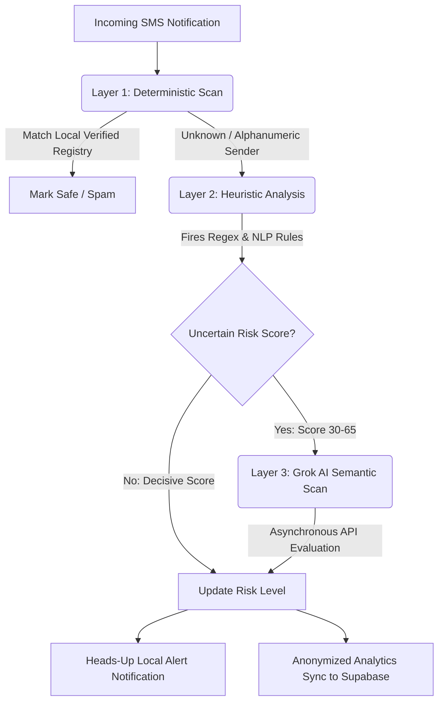

# OTP Defense: Anti-OTP Spoofing & Phishing Shield

An advanced, real-time OTP security shielding application designed to combat SMS/OTP spoofing, phishing, and transactional fraud in the Sri Lankan financial context. This project is developed in accordance with the final year project guidelines of **Plymouth University**.

---

## 🎓 Academic Submission Metadata

- **Project Title:** OTP Spoofing & Phishing Defense System
- **University:** University of Plymouth (UK)
- **Course:** BSc (Hons) in Computer Science / Software Engineering
- **Student Name:** Minoli Silva
- **Developer Profile:** [@MinoliSilva](https://github.com/MinoliSilva)
- **Target Platform:** Android (SDK 21+)

---

## 🛡️ Project Overview

In recent years, SMS OTP (One-Time Password) intercept and spoofing attacks have grown exponentially, especially in developing banking corridors. Attackers masquerade as legitimate financial institutions (like Sampath Bank, ComBank, BOC) or telecoms (Dialog, Mobitel) using custom alphanumeric SMS gateways to trick victims into sharing OTP credentials or navigating to malicious clones.

**OTP Defense** is a mobile application built in Flutter that acts as a proactive security layer. It captures incoming notification payloads via a secure Android Accessibility service, runs them through an instant three-layer risk scoring engine, warns the user via heads-up alerts if a threat is detected, and securely stores legitimate OTPs in an isolated, biometric-guarded vault.

---

## ⚙️ Three-Layer Hybrid Security Architecture

To guarantee low-latency analysis without compromising safety, the application uses a **Hybrid Security Architecture**:

### 1. Layer 1: Deterministic Scan (O(1) Local Lookup)
Instantly cross-references the Sender ID against a local, verified registry containing official transactional identifiers of Sri Lankan financial institutions, government agencies, and utility services (e.g., `SAMPATH`, `COMBANK`, `DIALOG`, `SLPost`). If a verified sender transmits a structurally valid OTP with no malicious links, it is instantly cleared.

### 2. Layer 2: Heuristic Analysis (NLP & Keyword Score Matrix)
If the sender is unknown, a local heuristic scanner scores the message content against a matrix of risk rules:
- **Private Numbers sending OTPs:** High base risk penalty.
- **Urgency NLP combination:** Urgency expressions combined with account-related action verbs.
- **Multilingual Keywords:** Support for Sinhala (e.g., `ලොගින්`, `අත්හිටුවා`) and Tamil keywords alongside English threat phrases.
- **URL Verification:** Classifies URLs to distinguish secure recognized platforms from malicious shorteners and unknown IPs.

### 3. Layer 3: Grok LLM Semantic AI Scan (Cloud Agent)
For ambiguous messages where the heuristic engine returns an uncertain score (30% to 65%), the app asynchronously queries a lightweight neural classifier powered by Groq (`gemma2-9b-it`). The AI agent interprets semantic cues (such as emotional manipulation or high-pressure phishing prompts) and blends its insights with the heuristic scan to determine the final security verdict.

---

